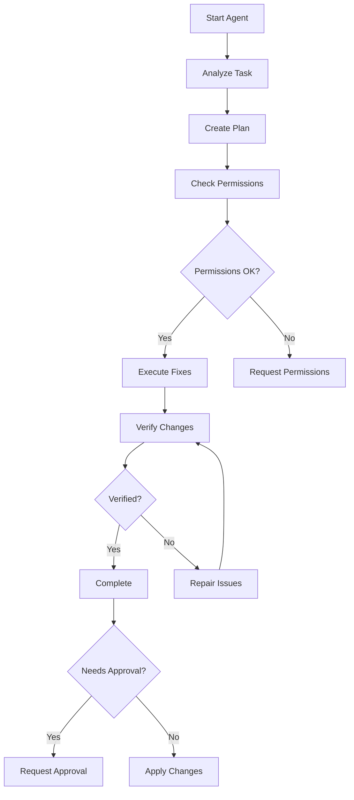

# Advanced Quality Tool - Agent System User Guide

## Table of Contents

- [Overview](#overview)
- [What is the Agent System?](#what-is-the-agent-system)
- [Key Concepts](#key-concepts)
- [Getting Started](#getting-started)
- [CLI Usage](#cli-usage)
- [API Usage](#api-usage)
- [MCP Usage](#mcp-usage)
- [Agent Workflows](#agent-workflows)
- [Configuration](#configuration)
- [Best Practices](#best-practices)
- [Safety Guidelines](#safety-guidelines)
- [Troubleshooting](#troubleshooting)
- [Advanced Topics](#advanced-topics)

---

## Overview

The Advanced Quality Tool (AQT) Agent System is an autonomous code quality improvement system that can analyze, plan, execute, and verify code changes with minimal human intervention. It combines AI-powered code generation with rule-based fixes, intelligent planning, and safety controls to deliver high-quality automated code improvements.

### Key Features

✨ **Autonomous Planning** - Agent analyzes tasks and creates detailed execution plans
🔧 **Multi-Strategy Fixes** - Combines rule-based, AI-assisted, and hybrid approaches
🛡️ **Safety First** - Permission systems, approval workflows, and verification loops
📊 **Progress Tracking** - Real-time monitoring of agent work with detailed logs
🔄 **Verification & Repair** - Automatic verification with iterative repair capabilities
✅ **Acceptance Workflows** - Human approval gates for critical changes
💰 **Cost Controls** - Track and limit AI provider costs
🔒 **Privacy Protection** - Automatic secret redaction and privacy controls

---

## What is the Agent System?

The Agent System is a sophisticated autonomous workflow engine that:

1. **Receives** a high-level task description (e.g., "Fix all security vulnerabilities")
2. **Plans** the work by breaking it into concrete steps
3. **Analyzes** scope, complexity, and requirements
4. **Executes** fixes using appropriate strategies (rule-based or AI)
5. **Verifies** changes through linting, testing, and validation
6. **Repairs** any issues found during verification
7. **Requests** human approval for critical changes
8. **Tracks** progress and maintains detailed logs

### Architecture Overview

```
┌─────────────────────────────────────────────────────────────┐
│                     Work Orchestrator                        │
│         (Manages queue, concurrency, timeouts)              │
└────────────┬────────────────────────────────────────────────┘
             │
             ▼
┌─────────────────────────────────────────────────────────────┐
│                      Agent Planner                           │
│    ┌────────────┐  ┌──────────────┐  ┌─────────────┐       │
│    │   Scope    │  │     Tool     │  │ Permission  │       │
│    │  Analyzer  │  │   Registry   │  │   Manager   │       │
│    └────────────┘  └──────────────┘  └─────────────┘       │
└────────────┬────────────────────────────────────────────────┘
             │
             ▼
┌─────────────────────────────────────────────────────────────┐
│                   Execution Phase                            │
│    ┌────────────────┐         ┌──────────────────┐         │
│    │ Code Generator │◄───────►│  Verification &  │         │
│    │                │         │   Repair Loop    │         │
│    └────────────────┘         └──────────────────┘         │
└────────────┬────────────────────────────────────────────────┘
             │
             ▼
┌─────────────────────────────────────────────────────────────┐
│                  Acceptance Workflow                         │
│            (Human approval & finalization)                   │
└─────────────────────────────────────────────────────────────┘
```

---

## Key Concepts

### Work Items

A **Work Item** represents a unit of autonomous work. It includes:

- **Description**: Natural language task description
- **Type**: `fix`, `refactor`, `implement`, `review`, `test`
- **Files**: Affected file paths (optional)
- **Priority**: `critical`, `high`, `medium`, `low`
- **Status**: `queued`, `planning`, `executing`, `verifying`, `pending-approval`, `completed`, `failed`

### Execution Plan

An **Execution Plan** is created by the Agent Planner and contains:

- **Steps**: Ordered list of actions to perform
- **Dependencies**: Step dependencies
- **Estimated Time**: Time estimate for completion
- **Required Tools**: Tools needed for execution
- **Risk Assessment**: Potential issues and mitigation
- **Success Criteria**: How to verify success

### Permissions

The **Permission System** controls what the agent can do:

- **File Access**: Which directories and files can be modified
- **Network Access**: Whether network calls are allowed
- **Shell Access**: Whether shell commands can be executed
- **Secret Protection**: Automatic redaction of sensitive data

### Verification Loop

The **Verification & Repair Loop** ensures quality:

1. Execute changes
2. Run verification (lint, test, type-check)
3. If issues found, attempt repair
4. Repeat up to max iterations
5. Return final result

### Approval Workflow

The **Acceptance Workflow** provides human oversight:

- **Automatic Approval**: Low-risk changes (configurable)
- **Manual Approval**: High-risk changes require human review
- **Approval Criteria**: Tests pass, lint clean, review approved
- **Rejection Handling**: Rejected changes can be modified and resubmitted

---

## Getting Started

### Prerequisites

1. **Node.js 18+** installed
2. **AQT installed**: `npm install -g advanced-quality-tool`
3. **AI Provider API Key** (optional, for AI-assisted fixes):
   - OpenAI: `OPENAI_API_KEY`
   - Anthropic: `ANTHROPIC_API_KEY`
   - Google: `GOOGLE_AI_API_KEY`
   - Or use local models via Ollama

### Basic Setup

1. **Initialize Configuration**:
```bash
aqt config set agent.enabled true
aqt config set agent.maxConcurrent 3
aqt config set agent.timeout 300000
```

2. **Configure Permissions** (optional):
```bash
aqt config set agent.permissions.allowedPaths "src/,lib/"
aqt config set agent.permissions.deniedPaths "src/secrets/,config/production/"
aqt config set agent.permissions.allowNetwork false
```

3. **Set AI Provider** (optional):
```bash
export OPENAI_API_KEY="your-key-here"
aqt config set agent.provider openai
aqt config set agent.model gpt-4
```

---

## CLI Usage

### Start Agent Work

```bash
# Basic usage
aqt agent start "Fix all security vulnerabilities"

# With options
aqt agent start "Refactor authentication module" \
  --files "src/auth/" \
  --priority high \
  --auto-approve low-risk

# With specific strategy
aqt agent start "Fix linting errors" \
  --strategy rule-first \
  --dry-run

# With approval workflow
aqt agent start "Implement user profile feature" \
  --require-approval \
  --approvers "tech-lead,architect"
```

### Check Agent Status

```bash
# Check specific work item
aqt agent status <work-id>

# List all work items
aqt agent list

# List active work items only
aqt agent list --status executing

# List with details
aqt agent list --verbose
```

### View Agent Logs

```bash
# View logs for specific work item
aqt agent logs <work-id>

# Follow logs in real-time
aqt agent logs <work-id> --follow

# Show only errors
aqt agent logs <work-id> --level error

# Export logs to file
aqt agent logs <work-id> --output agent-logs.txt
```

### Approve Agent Changes

```bash
# Approve pending work
aqt agent approve <work-id>

# Approve with comment
aqt agent approve <work-id> --comment "LGTM, tested locally"

# Approve all pending for user
aqt agent approve --all --approver "tech-lead"
```

### Cancel Agent Work

```bash
# Cancel specific work item
aqt agent cancel <work-id>

# Cancel with reason
aqt agent cancel <work-id> --reason "Requirements changed"

# Cancel all queued items
aqt agent cancel --all --status queued
```

### Advanced Commands

```bash
# Replay completed work (for testing)
aqt agent replay <work-id>

# Show execution plan without executing
aqt agent plan "Implement feature X" --dry-run

# Check agent health and capabilities
aqt agent health

# View cost tracking
aqt agent costs --period month

# Export agent work report
aqt agent report <work-id> --format markdown
```

---

## API Usage

The Agent System is exposed via REST API at `/api/agent/*` endpoints.

### Authentication

```bash
export AQT_API_TOKEN="your-token"
```

All API requests require authentication:
```bash
curl -H "Authorization: Bearer $AQT_API_TOKEN" \
  http://localhost:3000/api/agent/...
```

### Start Agent Work

```bash
POST /api/agent/start

{
  "description": "Fix all security vulnerabilities",
  "type": "fix",
  "files": ["src/"],
  "priority": "high",
  "options": {
    "strategy": "rule-first",
    "dryRun": false,
    "autoApprove": ["low-risk"],
    "requireApproval": ["high-risk"]
  }
}

# Response
{
  "success": true,
  "data": {
    "workId": "work-abc123",
    "status": "queued",
    "estimatedTime": 120000
  }
}
```

### Get Agent Status

```bash
GET /api/agent/:id

# Response
{
  "success": true,
  "data": {
    "workId": "work-abc123",
    "status": "executing",
    "progress": 45,
    "currentStep": "Applying fixes",
    "steps": [...],
    "startTime": "2026-10-01T10:00:00Z",
    "estimatedCompletion": "2026-10-01T10:02:00Z"
  }
}
```

### List Agent Work

```bash
GET /api/agent?status=executing&limit=10

# Response
{
  "success": true,
  "data": {
    "items": [
      {
        "workId": "work-abc123",
        "description": "Fix security vulnerabilities",
        "status": "executing",
        "progress": 45
      }
    ],
    "total": 5,
    "page": 1
  }
}
```

### Cancel Agent Work

```bash
DELETE /api/agent/:id

{
  "reason": "No longer needed"
}

# Response
{
  "success": true,
  "data": {
    "workId": "work-abc123",
    "status": "cancelled"
  }
}
```

### Approve Agent Changes

```bash
POST /api/agent/:id/approve

{
  "approver": "tech-lead",
  "comment": "Looks good"
}

# Response
{
  "success": true,
  "data": {
    "workId": "work-abc123",
    "status": "approved",
    "approvedBy": "tech-lead",
    "approvedAt": "2026-10-01T10:05:00Z"
  }
}
```

### Get Agent Logs

```bash
GET /api/agent/:id/logs?limit=100

# Response
{
  "success": true,
  "data": {
    "logs": [
      {
        "timestamp": "2026-10-01T10:00:00Z",
        "level": "info",
        "message": "Starting work execution",
        "metadata": {}
      }
    ]
  }
}
```

### WebSocket Streaming

For real-time updates, connect to the WebSocket endpoint:

```javascript
const ws = new WebSocket('ws://localhost:3000/api/agent/stream');

ws.on('message', (data) => {
  const event = JSON.parse(data);
  
  if (event.type === 'progress') {
    console.log(`Work ${event.workId}: ${event.progress}%`);
  }
  
  if (event.type === 'log') {
    console.log(`[${event.level}] ${event.message}`);
  }
  
  if (event.type === 'complete') {
    console.log(`Work completed: ${event.workId}`);
  }
});
```

---

## MCP Usage

The Agent System is exposed via Model Context Protocol (MCP) for integration with AI assistants like Claude Desktop, Kiro, and VS Code extensions.

### Available MCP Tools

#### `aqt_agent_start`

Start autonomous agent work.

```json
{
  "name": "aqt_agent_start",
  "arguments": {
    "description": "Fix all security vulnerabilities",
    "type": "fix",
    "files": ["src/"],
    "priority": "high",
    "strategy": "rule-first",
    "autoApprove": ["low-risk"]
  }
}
```

#### `aqt_agent_status`

Get status of agent work.

```json
{
  "name": "aqt_agent_status",
  "arguments": {
    "workId": "work-abc123"
  }
}
```

#### `aqt_agent_list`

List all agent work items.

```json
{
  "name": "aqt_agent_list",
  "arguments": {
    "status": "executing",
    "limit": 10
  }
}
```

#### `aqt_agent_cancel`

Cancel agent work.

```json
{
  "name": "aqt_agent_cancel",
  "arguments": {
    "workId": "work-abc123",
    "reason": "Requirements changed"
  }
}
```

### MCP Configuration

Add to your MCP settings file (e.g., `claude_desktop_config.json`):

```json
{
  "mcpServers": {
    "aqt": {
      "command": "node",
      "args": [
        "/path/to/advanced-quality-tool/src/integrations/mcp-server.js"
      ],
      "env": {
        "AQT_PROJECT_ROOT": "/path/to/your/project",
        "OPENAI_API_KEY": "your-key-here"
      }
    }
  }
}
```

### Usage in Claude Desktop

```
You: Can you use AQT to fix all the security issues in my project?

Claude: I'll use the AQT agent system to fix security vulnerabilities.

[Calls aqt_agent_start with appropriate parameters]

The agent has been started (work ID: work-abc123). 
It's analyzing your project and will fix security issues automatically.

You can check progress with: aqt agent status work-abc123
```

---

## Agent Workflows

### Workflow 1: Automated Fix Workflow



### Workflow 2: Feature Implementation

1. **Planning Phase**
   - Agent analyzes feature description
   - Creates file structure
   - Plans implementation steps

2. **Implementation Phase**
   - Generates code for each file
   - Implements tests
   - Adds documentation

3. **Verification Phase**
   - Runs unit tests
   - Checks type safety
   - Validates lint rules

4. **Approval Phase**
   - Human reviews generated code
   - Approves or requests changes
   - Agent applies feedback

5. **Finalization Phase**
   - Applies approved changes
   - Updates related documentation
   - Commits changes (optional)

### Workflow 3: Refactoring Workflow

1. **Scope Analysis**
   - Identifies affected files
   - Detects dependencies
   - Assesses risk level

2. **Change Planning**
   - Creates step-by-step plan
   - Identifies breaking changes
   - Plans backward compatibility

3. **Incremental Refactoring**
   - Applies changes in small steps
   - Verifies after each step
   - Rolls back if issues found

4. **Comprehensive Verification**
   - Runs full test suite
   - Checks all dependent code
   - Validates performance

---

## Configuration

### Agent Configuration File

Create `.aqtrc` or `aqt.config.js` in your project root:

```javascript
module.exports = {
  agent: {
    // Orchestrator settings
    maxConcurrent: 3,
    timeout: 300000, // 5 minutes
    retryCount: 2,
    retryDelay: 5000,
    
    // Permission settings
    permissions: {
      allowedPaths: ['src/', 'lib/', 'test/'],
      deniedPaths: ['src/secrets/', 'config/production/'],
      allowNetwork: false,
      allowShell: false,
      autoApprove: ['lint', 'format', 'test-fix']
    },
    
    // AI provider settings
    provider: 'openai',
    model: 'gpt-4',
    fallbackModel: 'gpt-3.5-turbo',
    
    // Cost controls
    maxCostPerTask: 1.0, // $1 USD
    monthlyBudget: 100.0,
    
    // Verification settings
    verification: {
      enabled: true,
      maxIterations: 5,
      runTests: true,
      runLint: true,
      runTypeCheck: true
    },
    
    // Approval workflow
    approval: {
      required: ['high-risk', 'production'],
      optional: ['medium-risk'],
      auto: ['low-risk'],
      approvers: ['tech-lead', 'architect']
    }
  }
};
```

### Environment Variables

```bash
# AI Provider Keys
export OPENAI_API_KEY="sk-..."
export ANTHROPIC_API_KEY="sk-ant-..."
export GOOGLE_AI_API_KEY="AI..."

# Agent Settings
export AQT_AGENT_MAX_CONCURRENT=3
export AQT_AGENT_TIMEOUT=300000
export AQT_AGENT_PROVIDER=openai
export AQT_AGENT_MODEL=gpt-4

# Permission Settings
export AQT_AGENT_ALLOWED_PATHS="src/,lib/"
export AQT_AGENT_DENIED_PATHS="secrets/,config/prod/"
export AQT_AGENT_ALLOW_NETWORK=false

# Cost Controls
export AQT_AGENT_MAX_COST=1.0
export AQT_AGENT_MONTHLY_BUDGET=100.0
```

---

## Best Practices

### 1. Start with Clear Descriptions

✅ **Good**: "Fix all ESLint errors in src/auth/ related to unused variables"
❌ **Bad**: "Fix stuff"

### 2. Use Appropriate Risk Levels

- **Low Risk**: Formatting, linting, simple refactors
- **Medium Risk**: Logic changes, new features
- **High Risk**: Security changes, database migrations, API breaking changes

### 3. Set Permission Boundaries

```javascript
permissions: {
  allowedPaths: ['src/', 'test/'],  // Be specific
  deniedPaths: ['src/secrets/', 'config/prod/'],
  allowNetwork: false,  // Default to false
  allowShell: false     // Default to false
}
```

### 4. Monitor Progress

```bash
# Watch agent work in real-time
watch -n 1 'aqt agent status work-abc123'

# Or use the UI
aqt ui --open
```

### 5. Review Before Merging

Always review agent-generated changes before merging to main branch:

```bash
# Check what changed
git diff

# Run tests locally
npm test

# Review with team
gh pr create --title "Agent: Fix security issues"
```

### 6. Use Dry Run for Testing

```bash
# Test agent without applying changes
aqt agent start "Refactor module" --dry-run
```

### 7. Set Cost Limits

```bash
# Prevent runaway costs
aqt config set agent.maxCostPerTask 1.0
aqt config set agent.monthlyBudget 100.0

# Monitor costs
aqt agent costs --period month
```

### 8. Leverage Verification

Enable all verification steps:

```javascript
verification: {
  runTests: true,
  runLint: true,
  runTypeCheck: true,
  runSecurityScan: true
}
```

---

## Safety Guidelines

### Permission Model

The agent operates under a **principle of least privilege**:

1. **File Access**: Only specified paths
2. **Network Access**: Disabled by default
3. **Shell Access**: Disabled by default
4. **Secret Protection**: Auto-redaction of credentials

### Approval Gates

Use approval workflows for sensitive operations:

```javascript
approval: {
  // Always require approval for these
  required: [
    'database-migration',
    'api-breaking-change',
    'security-update',
    'production-config'
  ],
  
  // Auto-approve these low-risk changes
  auto: [
    'format',
    'lint-fix',
    'test-fix',
    'documentation'
  ]
}
```

### Secrets Protection

The agent automatically redacts:

- API keys (patterns: `sk-`, `api_key_`, etc.)
- Passwords (patterns: `password`, `passwd`, etc.)
- Tokens (patterns: `token`, `bearer`, etc.)
- Connection strings
- Private keys

### Verification Loop

The agent verifies all changes:

```javascript
{
  maxIterations: 5,          // Max repair attempts
  failureThreshold: 0.2,     // Fail if >20% checks fail
  breakOnCritical: true      // Stop on critical errors
}
```

### Audit Trail

All agent actions are logged:

```bash
# View audit log
aqt agent logs work-abc123 --audit

# Export for compliance
aqt agent report work-abc123 --format audit-log
```

---

## Troubleshooting

### Agent Won't Start

**Problem**: Agent starts but immediately fails

```bash
Error: Permission denied: /src/secrets/config.json
```

**Solution**: Check permission configuration

```bash
# View current permissions
aqt config get agent.permissions

# Update allowed paths
aqt config set agent.permissions.allowedPaths "src/,lib/"
```

### High Costs

**Problem**: Agent tasks costing too much

```bash
Warning: Task cost $5.23 exceeds limit $1.00
```

**Solution**: Use cheaper models or local execution

```bash
# Use cheaper model
aqt config set agent.model gpt-3.5-turbo

# Or use local model
aqt config set agent.provider ollama
aqt config set agent.model codellama
```

### Verification Failures

**Problem**: Changes fail verification repeatedly

```bash
Error: Verification failed after 5 iterations
```

**Solution**: Review verification settings or disable problematic checks

```bash
# Disable type checking temporarily
aqt agent start "Fix issues" --no-type-check

# Or review and fix root cause
aqt agent logs work-abc123 --level error
```

### Timeout Issues

**Problem**: Agent times out on large tasks

```bash
Error: Work item timed out after 300000ms
```

**Solution**: Increase timeout or break into smaller tasks

```bash
# Increase timeout
aqt config set agent.timeout 600000

# Or break into smaller tasks
aqt agent start "Fix auth issues in auth.js"
aqt agent start "Fix auth issues in login.js"
```

### Network Errors

**Problem**: AI provider connection fails

```bash
Error: ECONNREFUSED openai.com:443
```

**Solution**: Check network, API keys, and provider status

```bash
# Test API key
curl https://api.openai.com/v1/models \
  -H "Authorization: Bearer $OPENAI_API_KEY"

# Use local model as fallback
aqt config set agent.provider ollama
```

---

## Advanced Topics

### Custom Tool Integration

Register custom tools for the agent:

```javascript
const { ToolRegistry } = require('advanced-quality-tool/agent');

const registry = new ToolRegistry();

registry.register('deploy-preview', {
  description: 'Deploy preview environment',
  parameters: {
    branch: { type: 'string', required: true }
  },
  execute: async (params) => {
    // Deploy logic
    return { previewUrl: 'https://preview.example.com' };
  }
});
```

### Custom Verification Steps

Add custom verification:

```javascript
const { VerificationRepairLoop } = require('advanced-quality-tool/agent');

loop.addVerificationStep('security-scan', async (files) => {
  // Custom security scan
  const results = await runSecurityScan(files);
  return {
    passed: results.vulnerabilities.length === 0,
    issues: results.vulnerabilities
  };
});
```

### Cost Optimization

Strategies to reduce costs:

1. **Use Local Models**: Ollama, LM Studio
2. **Hybrid Approach**: Local for simple tasks, cloud for complex
3. **Caching**: Enable response caching
4. **Batch Operations**: Combine multiple small tasks

```javascript
{
  provider: 'hybrid',
  localFirst: true,
  cloudFallback: true,
  costThreshold: 0.10  // Use local if task < $0.10
}
```

### Multi-Agent Coordination

Run multiple agents in parallel:

```javascript
const orchestrator = new WorkOrchestrator({
  maxConcurrent: 5
});

// Queue multiple work items
const workIds = [
  orchestrator.queue({ description: 'Fix auth' }),
  orchestrator.queue({ description: 'Fix database' }),
  orchestrator.queue({ description: 'Fix API' })
];

// Wait for all to complete
await Promise.all(workIds.map(id => orchestrator.waitFor(id)));
```

---

## Support

- **Documentation**: https://github.com/your-org/advanced-quality-tool/docs
- **Issues**: https://github.com/your-org/advanced-quality-tool/issues
- **Discussions**: https://github.com/your-org/advanced-quality-tool/discussions

---

## License

MIT License - see LICENSE file for details
