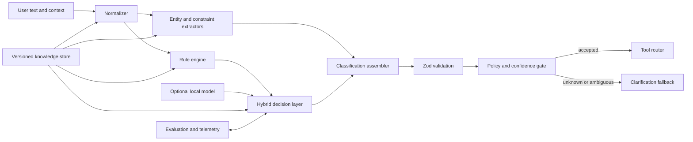

# Broad English Classifier Design

## 1. Purpose

This design turns the [broad English classification roadmap](broad-english-classification-roadmap.md) into an implementable architecture for `native-classifiers`.

The system classifies English software-development requests into a closed set of supported intents. It does not claim to understand all English. Unsupported, ambiguous, incomplete, or risky requests must produce a clarification outcome rather than a guessed tool action.

## 2. Goals

- Recognize supported intents across varied English phrasing.
- Preserve file paths, symbols, errors, quoted text, and other technical spans.
- Extract domains, typed entities, and constraints.
- Detect negation, modality, ambiguity, and unsupported input.
- Support ordered multi-action requests without silently dropping actions.
- Validate every classification and action before routing.
- Measure quality with versioned datasets and reproducible evaluation.
- Allow an optional self-hosted statistical classifier without changing safety boundaries.
- Load and roll back immutable knowledge-store releases.

## 3. Non-goals

- General-purpose English understanding.
- Open-ended text generation.
- Automatically executing every recognized action.
- Replacing authentication, authorization, approval, or tool argument validation.
- Calling JevAI or another hosted classification API.

## 4. Existing baseline

The current implementation provides:

- weighted regular-expression rules in `src/classifier.ts`
- the `AgentInput` Zod schema in `src/schema.ts`
- deterministic routing in `src/router.ts`
- clarification and failure handling in `src/fallback.ts`

Current limitations include hard-coded knowledge, limited paraphrase coverage, no explicit negation model, no ordered multi-intent representation, intuitive rather than calibrated confidence, and no evaluation pipeline.

## 5. Architectural principles

1. **Closed-world intents:** only documented intents can be routed.
2. **Unknown is valid:** uncertainty must resolve to clarification.
3. **Original text is immutable:** normalization creates derived views.
4. **Knowledge is data:** phrases and domain terms live outside source code.
5. **Safety is deterministic:** models and scores cannot bypass validation or policy.
6. **Every result is explainable:** retain matched evidence and score contributions.
7. **Quality is measured:** thresholds are selected from validation data.
8. **Releases are immutable:** taxonomy, knowledge, thresholds, and model artifacts share a version.

## 6. System context



## 7. Processing pipeline

### 7.1 Input boundary

Accept:

- raw user message
- repository identifier
- open files
- recent actions
- optional conversation context

Enforce input-size limits before normalization. Preserve the exact original message in the output packet and audit event.

### 7.2 Normalization

Create a `NormalizedInput` containing:

```typescript
type ProtectedSpanType =
  | "file"
  | "directory"
  | "url"
  | "quoted_text"
  | "symbol"
  | "error"
  | "stack_trace";

type NormalizedInput = {
  original: string;
  comparisonText: string;
  tokens: string[];
  protectedSpans: Array<{
    type: ProtectedSpanType;
    value: string;
    start: number;
    end: number;
  }>;
};
```

Apply Unicode NFKC normalization, whitespace normalization, lowercasing in the comparison view, and safe contraction expansion. Never rewrite protected spans.

### 7.3 Deterministic rule engine

The rule engine evaluates versioned phrase families. Each match emits evidence:

```typescript
type IntentEvidence = {
  intent: Intent;
  ruleId: string;
  phrase: string;
  weight: number;
  polarity: "positive" | "negative";
  span: [number, number];
};
```

Scoring rules:

- complete phrases score more than individual keywords
- specific phrases score more than generic verbs
- repeated synonyms do not multiply scores without a configured rule
- negated actions subtract or cancel intent evidence
- hypothetical and future actions receive a modality discount
- contradictory evidence lowers confidence
- all score contributions are retained for debugging

### 7.4 Entity and constraint extraction

Entity extractors run against both original and normalized views. The internal representation is typed:

```typescript
type TypedEntity = {
  type: "file" | "directory" | "symbol" | "framework" | "language" |
    "error" | "url" | "package" | "version" | "feature";
  value: string;
  normalizedValue?: string;
  span?: [number, number];
  confidence: number;
};
```

Constraints include prohibited actions, scope limits, compatibility requirements, approval requirements, and requested validation. Negated actions become constraints instead of intents.

The existing `entities: string[]` field remains populated for compatibility. A future version may add `typedEntities` after consumers support it.

### 7.5 Multi-intent planning

Split coordinated requests into clauses, classify each clause, and construct an ordered action plan. For example:

```text
Find the bug -> fix it -> run tests
```

During migration, `intent` remains the primary intent, `requiredTools` contains the safe ordered tool set, and `nextAction` is the first allowed action. A versioned schema extension will later add explicit `actions` after router and consumer support is complete.

### 7.6 Optional local model

The optional local classifier implements a stable interface:

```typescript
type IntentCandidate = { intent: Intent; score: number };

interface LocalIntentModel {
  classify(input: NormalizedInput): Promise<IntentCandidate[]>;
  readonly modelVersion: string;
}
```

Initial candidates are TF-IDF plus logistic regression or fastText. A compact ONNX model can be evaluated later. No model result routes directly; it only contributes candidates to the hybrid decision layer.

### 7.7 Hybrid decision and confidence

Decision order:

1. Apply high-precision safety and exact-match rules.
2. Combine deterministic and optional model candidates.
3. Apply negation and modality adjustments.
4. Compare the top candidate with configured absolute and margin thresholds.
5. Check required entities and domain support.
6. Force clarification for risky actions unless their stricter threshold is met.

Confidence must be calibrated on the validation dataset. It is not the raw rule score or raw model probability.

### 7.8 Validation and policy gate

Every assembled packet passes through Zod. The policy gate then checks:

- confidence threshold
- top-candidate margin
- intent/tool allowlist
- required entities
- prohibited constraints
- tool availability
- approval requirement

Failed checks produce a structured fallback reason. Tool-specific arguments require their own schemas immediately before invocation.

## 8. Knowledge-store layout

```text
knowledge store/
  design.md
  tasks.json
  manifest.json
  intents.json
  intent-phrases.json
  domains.json
  entities.json
  constraints.json
  abbreviations.json
  confusing-pairs.json
  thresholds.json
  examples/
    training.jsonl
    validation.jsonl
    test.jsonl
  releases/
    <version>/
      manifest.json
      metrics.json
```

All JSON files receive strict Zod schemas. Startup fails before serving requests when a release contains duplicate IDs, invalid regexes, unknown references, incompatible schema versions, or a checksum mismatch.

## 9. Knowledge contracts

### Intent definition

```json
{
  "id": "search_code",
  "description": "Locate code, symbols, references, or implementations.",
  "includes": ["find a symbol", "list usages"],
  "excludes": ["explain known code", "modify code"],
  "confusableWith": ["analyze", "explain"],
  "allowedFirstTools": ["search_code"],
  "risk": "read_only"
}
```

### Phrase rule

```json
{
  "id": "search.where-is",
  "intent": "search_code",
  "phrases": ["where is", "which file contains"],
  "weight": 8,
  "polarity": "positive",
  "requires": [],
  "excludes": []
}
```

### Dataset record

```json
{
  "id": "search-0001",
  "text": "Could you track down where refreshToken is called?",
  "intent": "search_code",
  "domain": "authentication",
  "entities": [{ "type": "symbol", "value": "refreshToken" }],
  "constraints": [],
  "source": "synthetic",
  "split": "training"
}
```

## 10. Proposed source modules

```text
src/
  normalization/
    normalize.ts
    protected-spans.ts
  knowledge/
    schemas.ts
    loader.ts
    release.ts
  classification/
    rule-engine.ts
    negation.ts
    modality.ts
    hybrid-classifier.ts
    confidence.ts
  extraction/
    entities.ts
    constraints.ts
  planning/
    clause-splitter.ts
    action-plan.ts
  evaluation/
    evaluator.ts
    metrics.ts
    report.ts
  telemetry/
    events.ts
    redaction.ts
  models/
    local-model.ts
```

Existing `schema.ts`, `router.ts`, and `fallback.ts` remain the execution boundary. `classifier.ts` becomes an orchestrator over these modules.

## 11. Evaluation design

The evaluator runs the immutable test set and reports:

- precision, recall, and F1 by intent
- macro and weighted averages
- confusion matrix
- unknown detection precision and recall
- entity precision and recall
- expected calibration error
- fallback rate
- incorrect tool-routing rate

Initial release gates:

- 100% of routed packets pass schema validation
- no high-risk action is routed below its threshold
- at least 95% precision for automatically executed intents
- every known production misclassification has a regression test
- no test-set regression against the previous release without explicit approval

## 12. Telemetry and privacy

Telemetry records classification version, candidate scores, matched rule IDs, fallback reason, and user correction. Before persistence:

- redact credentials and tokens
- avoid raw source-code storage
- hash or remove repository identifiers when unnecessary
- apply retention limits
- allow telemetry to be disabled

Training data must be reviewed and explicitly promoted; production logs never become training data automatically.

## 13. Versioning and release

The manifest binds:

- schema version
- taxonomy version
- rule version
- dataset version
- threshold version
- optional model version and checksum
- build timestamp
- evaluation report checksum
- previous rollback version

Load a release atomically. If validation fails, continue using the previous valid release. Never mix files from different versions in one classifier instance.

## 14. Migration plan

### Phase 1: Safety and measurement

Add explicit unknown behavior, taxonomy definitions, a test dataset, and baseline metrics without changing the public packet.

### Phase 2: Externalized deterministic knowledge

Add normalization and the validated knowledge loader, then migrate hard-coded rules into versioned files.

### Phase 3: Language breadth

Add phrase families, negation, modality, typed entities, and multi-intent planning.

### Phase 4: Feedback and release operations

Add privacy-safe telemetry, correction review, immutable releases, and rollback.

### Phase 5: Optional local model

Benchmark local statistical approaches and adopt one only when it improves the untouched test set and unknown handling without weakening safety gates.

## 15. Key decisions

- Unknown input initially uses the existing low-confidence clarification path to preserve compatibility.
- Knowledge files are configuration, but they are validated and released like code.
- The rule engine remains authoritative for prohibitions and high-risk safety rules.
- A local model is optional and replaceable behind `LocalIntentModel`.
- Explicit action arrays require a versioned schema migration; they are not added silently.
- Router authorization remains independent from classifier confidence.


